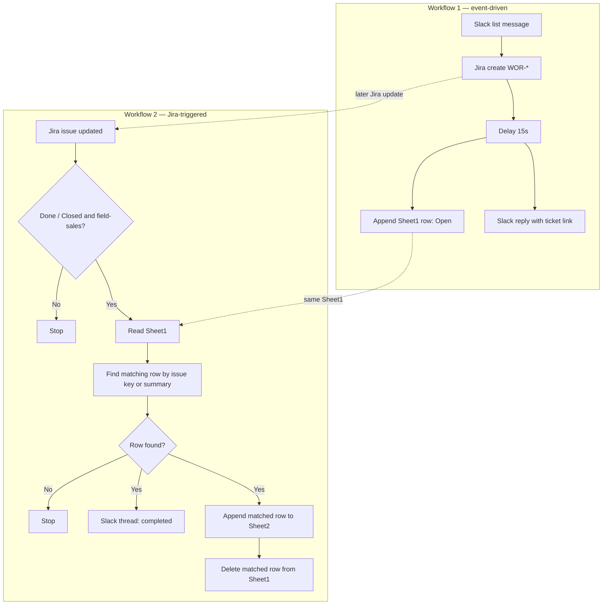
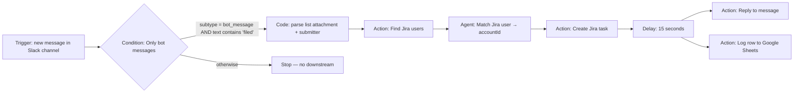
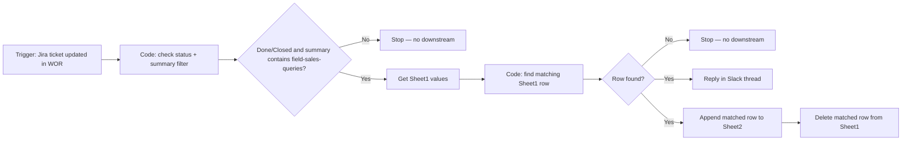

# Field Sales Queries — workflows

Langdock workflow exports (`schema: ldwf`) for turning Slack field-sales list submissions into Jira tickets, tracking them in Google Sheets, and closing the loop in Slack when issues are done.

**Related links** (mirrors `links.md`):

- **Google Sheet** (shared tracker): https://docs.google.com/spreadsheets/d/1jnhL-Ck1jgSaBKn13k7D_dw2yDnfIvBZBnmLb2Uz9xA/edit?usp=sharing  
- Workflow 1 (Langdock editor): https://app.langdock.com/workflows/aab23b86-4776-48b4-80fd-83a487baf3f5  
- Workflow 2 (Langdock editor): https://app.langdock.com/workflows/f35115f6-a577-420a-8b8d-37e7e3e658ad  
- Jira Automation (WOR project): https://people-team.atlassian.net/jira/servicedesk/projects/WOR/settings/automate#/rule/019dd89a-e393-7de4-9c24-2cf9c7780548  
- Jira board / sample issue (PSE): https://people-team.atlassian.net/jira/software/projects/PSE/boards/73?selectedIssue=PSE-1  

Exports in this folder were last saved on **2026-04-29** for Workflow 1 and **2026-05-12** for Workflow 2 (see `meta.exportedAt` in each JSON file).

---

## How the two JSON files work together

| File | Role |
|------|------|
| `Field Sales Queries 1.json` | **Ingestion** — Slack list submission → Jira ticket + **Sheet1** row (`Open`) + confirmation reply. |
| `Field Sales Queries 2.json` | **Reconciliation** — On a Jira update event, filters for completed field-sales tickets, finds the matching **Sheet1** row, notifies the Slack thread, archives the row on **Sheet2**, and removes it from **Sheet1**. |

The workflows do not invoke each other in Langdock. Workflow 1 writes the Jira key, Slack thread metadata, and tracking status to the shared **spreadsheet** (ID `1jnhL-Ck1jgSaBKn13k7D_dw2yDnfIvBZBnmLb2Uz9xA`; open in browser via the link above). Workflow 2 is triggered by Jira, then uses that shared **Sheet1** row layout to find the Slack thread to close out.

---

## Workflow 1 — end-to-end flow

**Order of execution**

1. **Trigger** — Listens to Slack channel `C0AEAG522T0`.
2. **Condition (`Only bot messages`)** — Continues only if the message is a bot message whose text includes `filed`.
3. **Code** — Parses the List attachment into fields (`request`, `details`, …) and `submitted_by_name` from the `@Name (` mention pattern in the message text.
4. **Find Jira user** — Searches Jira with the submitter name.
5. **Match Jira user (agent)** — Returns `accountId` (prefers `@sumup.com`).
6. **Create task** — Project **WOR**, issue type from config, summary `{{request}} - #field-sales-queries`, description + Slack `ts` embedded as `_slack_thread_ts:<ts>_`, reporter = matched user.
7. **Delay** — Waits **15 seconds** (allows Jira indexing before downstream steps).
8. **Parallel** — **Reply** with Service Desk portal link and mention; **Sheet1** append (see expected outputs).

**Error handling** — `strategy: stop` on most nodes; failures abort the run.

---

## Workflow 2 — end-to-end flow

**Order of execution**

1. **Trigger** — Runs when a Jira issue in project **WOR** is updated.
2. **Check filter criteria** — Continues only when the Jira status is **Done** or **Closed** and the lowercased summary contains `field-sales-queries`.
3. **Get open Jira tickets from sheet** — Reads **Sheet1** of the shared spreadsheet.
4. **Find matching row for Jira ticket** — Looks through the returned sheet rows and matches when any cell exactly equals the Jira issue key (for example `WOR-15608`) or the Jira issue summary. It returns the matched row, row index, issue key/summary, Slack channel id (`row[2]`), and Slack thread timestamp (`row[1]`).
5. **Row found?** — If no row matches, the workflow stops with no Slack or Sheets writes.
6. **If row found** — The workflow replies in the original Slack thread and appends the matched row to **Sheet2**. After the Sheet2 append succeeds, it deletes the matched row from **Sheet1** using the stored row index.

**Error handling** — Nodes use `strategy: stop`; a failed filter, lookup, Slack reply, append, or delete stops that run.

---

## Expected outputs — Workflow 1

| Destination | Expected result |
|-------------|-----------------|
| **Jira** | New issue **WOR-*** with summary from the list request + `#field-sales-queries`, description with details and `_slack_thread_ts:<ts>_`, reporter = matched user. |
| **Slack** | Thread reply tagging the submitter (`submitted_by`) with a link to the **Service Desk customer portal** for the ticket: `people-team.atlassian.net/servicedesk/customer/portal/18/<KEY>` (not the generic `/browse/` URL). |
| **Google Sheets — Sheet1** | One new row: **key**, **message `ts`**, channel `C0AEAG522T0`, status **`Open`**, **submitter Slack user id** (`submitted_by`). |

If the bot/`filed` condition fails, nothing is written to Jira, Sheet1, or Slack.

---

## Expected outputs — Workflow 2

| Destination | Expected result |
|-------------|-----------------|
| **Jira** | Read-only trigger source: the workflow reacts to updates but does not modify Jira issues. |
| **Slack** | If the updated Jira issue is **Done/Closed**, has `field-sales-queries` in the summary, and a matching Sheet1 row is found: a **thread reply** on the original channel/thread with a brief completion message. |
| **Google Sheets — Sheet2** | One appended row per matched completed ticket, using the matched Sheet1 row wrapped as a 2D array (`[[col1, col2, ...]]`). |
| **Google Sheets — Sheet1** | The matched row is **removed** after the Sheet2 append succeeds. |

Rows for tickets that are not yet **Done**/**Closed**, do not include `field-sales-queries` in the summary, or do not match the updated Jira issue stay on Sheet1.

---

## Sheet1 row shape (shared contract)

For Workflow 2’s lookup, Slack reply, and delete logic to work, Sheet1 rows written by Workflow 1 should keep this column order:

| Index | Meaning |
|-------|---------|
| 0 | Jira issue key |
| 1 | Slack thread `ts` |
| 2 | Slack channel id |
| 3 | Status text (`Open` while tracked) |
| 4 | Submitter / fifth metadata column |

Workflow 2 relies on indexes `1` and `2` for the Slack thread and channel, and searches all row cells for an exact match to the Jira issue key or summary. It computes the matched row index internally for deletion; the row index is not an extra Sheet1 column.
