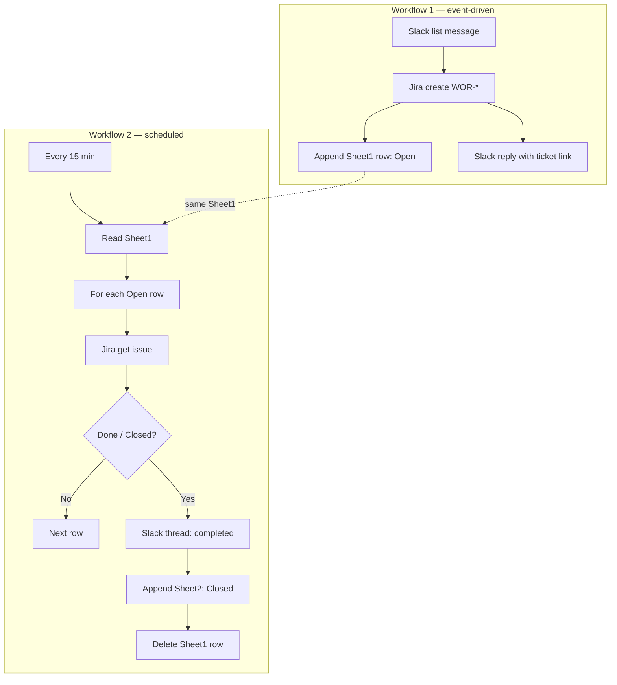
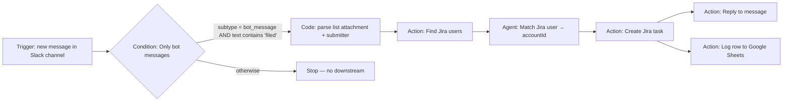
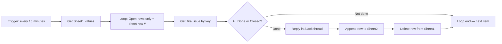

# Field Sales Queries — workflows

Langdock workflow exports (`schema: ldwf`) for turning Slack field-sales list submissions into Jira tickets, tracking them in Google Sheets, and closing the loop in Slack when issues are done. Live editor links: see `links.md`.

---

## How the two JSON files work together

| File | Role |
|------|------|
| `Field Sales Queries 1.json` | **Ingestion** — Slack list submission → Jira ticket + **Sheet1** row (`Open`) + confirmation reply. |
| `Field Sales Queries 2.json` | **Reconciliation** — On a schedule, reads **Sheet1**, checks Jira for each **Open** row; when status is **Done** or **Closed**, notifies the Slack thread, archives a row on **Sheet2**, and removes the row from **Sheet1**. |

The workflows do not invoke each other in Langdock. They share the same **spreadsheet** (`1jnhL-Ck1jgSaBKn13k7D_dw2yDnfIvBZBnmLb2Uz9xA`) and the same **Sheet1** column layout so Workflow 2 can consume what Workflow 1 writes.

---

## Workflow 1 — end-to-end flow

**Order of execution**

1. **Trigger** — Listens to Slack channel `C0AEAG522T0`.
2. **Condition (`Only bot messages`)** — Continues only if the message is a bot message whose text includes `filed`.
3. **Code** — Parses the List attachment into fields (`request`, `details`, …) and `submitted_by_name` from the `@Name (` mention.
4. **Find Jira user** — Searches Jira with the submitter name.
5. **Match Jira user (agent)** — Returns `accountId` (prefers `@sumup.com`).
6. **Create task** — Project **WOR**, summary `{{request}} - #field-sales-queries`, description + Slack `ts`, reporter = matched user.
7. **Parallel** — **Reply** with Jira link; **Sheet1** append (see expected outputs).

**Error handling** — `strategy: stop` on most nodes; failures abort the run.

---

## Workflow 2 — end-to-end flow

**Order of execution**

1. **Schedule** — Cron `*/15 * * * *` (every 15 minutes).
2. **Get open Jira tickets from sheet** — Reads **Sheet1** of the shared spreadsheet.
3. **Loop over tickets** — Builds items from all data rows after the header: keeps rows where status column (index `3`) is **`Open`**, and appends the **Google Sheet row number** as the last element (`i + 2`) for delete-range operations.
4. **Get Jira issue status** — Uses the ticket key from `currentItem[0]`.
5. **Is ticket Done?** — Prompt-based branch on `getJiraIssue` output: **Done** or **Closed** vs still in progress.
6. **If not done** — Goes to **Loop end** (next iteration).
7. **If done** — **Reply in Slack thread** (`threadTs` and `channelId` from the row) → **Append to Sheet2** (archived “Closed” row) → **Delete** that row from **Sheet1** using the stored row index → **Loop end**.

**Error handling** — Loop end uses `continue` on errors so one bad row may not stop the whole loop; other nodes use `stop` where configured.

---

## Expected outputs — Workflow 1

| Destination | Expected result |
|-------------|-----------------|
| **Jira** | New issue **WOR-*** with summary from the list request + `#field-sales-queries`, description with details and `_slack_thread_ts:<ts>_`, reporter = matched user. |
| **Slack** | Thread reply with link to `people-team.atlassian.net/browse/<KEY>`. |
| **Google Sheets — Sheet1** | One new row: **key**, **message `ts`**, channel `C0AEAG522T0`, status **`Open`**, **submitter Slack user id** (`submitted_by`). |

If the bot/`filed` condition fails, nothing is written to Jira, Sheet1, or Slack.

---

## Expected outputs — Workflow 2

| Destination | Expected result |
|-------------|-----------------|
| **Jira** | Read-only: status check only; no issue updates from this workflow. |
| **Slack** | For each row that was **Open** in Sheet1 and is now **Done/Closed** in Jira: a **thread reply** on the original channel/thread: ticket key + “completed” message. |
| **Google Sheets — Sheet2** | One appended row per closed ticket: **key**, **thread `ts`**, **channel id**, status **`Closed`**, fifth column from `currentItem[4]` (same Sheet1 column as Workflow 1’s fifth field — the workflow’s append prompt labels it “summary”; the sheet column is whatever Workflow 1 wrote in position 5, typically submitter id). |
| **Google Sheets — Sheet1** | The corresponding **Open** row is **removed** after a successful close path (reply → append Sheet2 → delete). |

Rows that are still not **Done**/**Closed** in Jira stay on Sheet1 and are re-checked on the next run.

---

## Sheet1 row shape (shared contract)

For Workflow 2’s loop and delete logic to work, Sheet1 rows written by Workflow 1 should keep this column order:

| Index | Meaning |
|-------|---------|
| 0 | Jira issue key |
| 1 | Slack thread `ts` |
| 2 | Slack channel id |
| 3 | Status text (`Open` while tracked) |
| 4 | Submitter / fifth metadata column |

Workflow 2 appends a **row index** internally for deletion (not an extra Sheet1 column).
